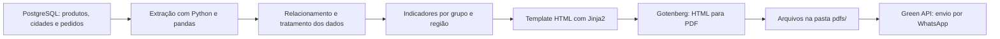

# Airflow — Pedidos a Faturar

> Pipeline de ETL desenvolvido com Apache Airflow e Python para extrair dados de pedidos em PostgreSQL, consolidar indicadores, gerar relatórios em PDF e enviá-los automaticamente por WhatsApp.

[](https://www.python.org/)[](https://airflow.apache.org/)[](https://www.postgresql.org/)[](https://docs.docker.com/compose/)

## Visão geral

O **Airflow — Pedidos a Faturar** automatiza uma rotina de acompanhamento de pedidos pendentes de faturamento. O pipeline consulta tabelas de produtos, cidades e pedidos em um banco PostgreSQL, realiza os relacionamentos e as transformações necessárias, calcula indicadores por grupo e região, gera relatórios em PDF e envia os arquivos por WhatsApp utilizando a Green API.

O projeto foi estruturado para execução local com Docker Compose e utiliza uma DAG do Airflow para orquestrar o processo em etapas encadeadas. A execução está configurada para ocorrer de segunda a sexta-feira, às 7h30, no fuso horário `America/Sao_Paulo`.

## Fluxo do pipeline



A DAG `pipeline_v1` executa três tarefas de extração em paralelo. Depois, o fluxo aguarda o carregamento de produtos, cidades e pedidos para realizar o tratamento dos dados, gerar os indicadores, criar os PDFs e enviar os relatórios gerados.

## Funcionalidades

- Extração das tabelas `produtos`, `cidades` e `pedidos` a partir do PostgreSQL.

- Integração das tabelas por meio das chaves `CodProduto` e `CodCidUF`.

- Geração de indicadores de quantidade agrupados por `Grupo` e `Região`.

- Inclusão de uma linha de total nos relatórios consolidados.

- Formatação das quantidades com separador de milhares no padrão brasileiro.

- Renderização de relatórios HTML com template Jinja2.

- Conversão dos relatórios HTML para PDF por meio do Gotenberg.

- Armazenamento dos PDFs no diretório `pdfs/`.

- Envio dos relatórios PDF por upload para um destinatário configurado no módulo de WhatsApp.

- Orquestração e monitoramento das etapas com Apache Airflow e `PythonOperator`.

## Tecnologias utilizadas

| Tecnologia | Papel no projeto |
| --- | --- |
| **Apache Airflow 3.1.0** | Orquestra a DAG, agenda a execução e transporta os resultados entre tarefas por XCom. |
| **Python** | Implementa a extração, transformação, geração de indicadores, criação dos relatórios e envio dos arquivos. |
| **pandas** | Manipula os DataFrames, realiza agrupamentos, junções e cálculos de quantidade. |
| **PostgreSQL 16** | Armazena tanto o banco interno do Airflow quanto o banco de origem `sistema_empresa` definido no Compose. |
| **Redis 7.2** | Atua como broker do `CeleryExecutor` utilizado pelo Airflow. |
| **CeleryExecutor** | Permite distribuir a execução das tarefas entre workers do Airflow. |
| **Jinja2** | Renderiza o template HTML a partir dos registros calculados. |
| **Gotenberg 8** | Converte o HTML renderizado em arquivos PDF por meio de uma API HTTP. |
| **Requests** | Realiza as requisições HTTP para o Gotenberg e para a Green API. |
| **Green API** | Serviço utilizado pelo projeto para enviar os PDFs por WhatsApp. |
| **Docker Compose** | Inicializa e conecta os serviços necessários para o ambiente local. |
| **Dev Container** | Oferece uma configuração de desenvolvimento para uso com VS Code e o serviço `airflow-worker`. |

## Arquitetura do projeto

```
.
├── .devcontainer/
│   └── devcontainer.json          # Configuração opcional para VS Code Dev Containers
├── config/
│   └── airflow.cfg                # Configuração do Airflow
├── dags/
│   ├── etl/
│   │   ├── extract.py             # Extração das tabelas PostgreSQL
│   │   ├── transforms.py          # Junções, tratamento e indicadores
│   │   └── loads.py               # Renderização HTML e geração dos PDFs
│   ├── sender/
│   │   └── whatsapp.py            # Envio dos PDFs por WhatsApp
│   └── pipeline_v1.py             # DAG e dependências das tarefas
├── pdfs/                          # PDFs gerados pelo pipeline
├── templates/
│   ├── index.html                 # Arquivo HTML gerado durante o processo
│   └── template.html              # Template Jinja2 dos relatórios
├── .gitignore
└── docker-compose.yaml             # Ambiente local do Airflow e serviços auxiliares
```

## Pré-requisitos

Para executar o ambiente local, são necessários:

- Docker Engine com Docker Compose;

- acesso às portas locais `8080`, `3000` e `5433`, conforme a configuração do Compose;

- pelo menos duas CPUs e aproximadamente 4 GB de memória disponíveis para os containers, conforme as verificações presentes no serviço de inicialização do Airflow;

- credenciais e acesso ao serviço da Green API;

- dados compatíveis com as tabelas `produtos`, `cidades` e `pedidos` no PostgreSQL de origem.

O Compose utiliza a imagem `apache/airflow:3.1.0`, PostgreSQL 16, Redis 7.2, Gotenberg 8 e os serviços auxiliares do Airflow com `CeleryExecutor`.

## Instalação e inicialização

Clone o repositório e entre no diretório do projeto:

```bash
git clone https://github.com/felipemonsef10/airflow-pedidos-a-faturar.git
cd airflow-pedidos-a-faturar
```

Em sistemas Linux, defina o UID do usuário que deverá ser utilizado nos volumes do Airflow. Essa configuração ajuda a evitar arquivos pertencentes ao usuário `root`:

```bash
echo "AIRFLOW_UID=$(id -u )" > .env
```

Inicialize o banco de dados e o usuário administrador do Airflow:

```bash
docker compose up airflow-init
```

Suba os serviços em segundo plano:

```bash
docker compose up -d
```

Após a inicialização, acesse a interface web em [http://localhost:8080](http://localhost:8080). Quando nenhuma credencial alternativa é definida no ambiente, o serviço de inicialização utiliza os valores padrão declarados no `docker-compose.yaml`; altere-os antes de qualquer uso fora de um ambiente local.

Para acompanhar os serviços:

```bash
docker compose ps
docker compose logs -f airflow-scheduler
```

Para interromper o ambiente:

```bash
docker compose down
```

Para interromper o ambiente e remover os volumes persistentes declarados pelo Compose, utilize essa operação somente quando tiver certeza de que os dados podem ser descartados:

```bash
docker compose down -v
```

## Configuração do banco de origem

A extração está implementada em `dags/etl/extract.py` e utiliza atualmente os seguintes parâmetros fixos:

| Parâmetro | Valor atual |
| --- | --- |
| Usuário | `airflow` |
| Banco | `sistema_empresa` |
| Porta | `5433` |
| Host | `192.168.56.1` |
| Tabelas consultadas | `produtos`, `cidades` e `pedidos` |

A consulta utilizada pelo código segue o formato abaixo:

```sql
SELECT * FROM <nome_da_tabela>;
```

O serviço `postgres-empresa` declarado no `docker-compose.yaml` publica a porta `5433` do host e cria o banco `sistema_empresa`. Antes de executar a DAG, confirme se o host configurado no código é acessível a partir dos containers. Em um cenário de comunicação direta pela rede interna do Compose, pode ser necessário utilizar o nome do serviço `postgres-empresa` e a porta interna `5432`, em vez do endereço `192.168.56.1:5433`.

As tabelas precisam conter, no mínimo, as colunas usadas pelo fluxo:

- `pedidos`: `CodProduto`, `CodCidUF` e `Quantidade`;

- `produtos`: `CodProduto` e `Grupo`;

- `cidades`: `ChaveCidade` e `Região`.

O código renomeia `ChaveCidade` para `CodCidUF` antes de realizar os relacionamentos.

## Configuração da Green API

O módulo `dags/sender/whatsapp.py` lê as credenciais abaixo a partir das **Variables do Airflow**:

| Variable | Finalidade |
| --- | --- |
| `idInstance` | Identificador da instância da Green API. |
| `apiTokenInstance` | Token usado na URL de envio da Green API. |

Configure essas variáveis pela interface do Airflow antes de executar a etapa de envio. Não grave tokens diretamente no código nem no repositório.

O destinatário atual está definido diretamente no código como um `chatId` de WhatsApp. Para reutilizar o projeto com outro destinatário, altere essa configuração para uma variável segura do Airflow ou para outra forma de configuração externa. O fluxo percorre todos os arquivos presentes em `pdfs/` e tenta enviá-los como arquivos PDF.

## Execução da DAG

A DAG possui o identificador `pipeline_v1` e está configurada para executar de segunda a sexta-feira às `07:30`, no fuso `America/Sao_Paulo`, com `catchup=False`.

A cadeia de tarefas é:

```
carregar_dados_tabela_produtos ─┐
carregar_dados_tabela_cidades  ──┼─> tratar_dados_tabelas
carregar_dados_tabela_pedidos  ─┘          │
                                          v
                                  gerar_indicadores
                                          │
                                          v
                                  gerar_relatorios_pdf
                                          │
                                          v
                                  enviar_relatorios_pdf
```

A DAG pode ser acionada pela interface do Airflow após os serviços estarem saudáveis. O relatório gerado contém, conforme os indicadores produzidos pelo código, visões agregadas por grupo e por região.

## Relatórios gerados

O módulo `loads.py` usa `templates/template.html` para renderizar uma tabela HTML com título, data de criação e registros. Em seguida, o HTML é enviado ao endpoint local do Gotenberg:

```
http://192.168.56.1:3000/forms/chromium/convert/html
```

Os arquivos finais são gravados em:

```
pdfs/qtd_por_grupo.pdf
pdfs/qtd_por_rg.pdf
```

Os nomes correspondem às chaves retornadas pela etapa de indicadores. O diretório `pdfs/` também é montado nos containers pelo Docker Compose, permitindo que a etapa de envio encontre os arquivos produzidos anteriormente.

## Desenvolvimento com Dev Container

O arquivo `.devcontainer/devcontainer.json` configura o uso do Compose no VS Code e conecta o ambiente de desenvolvimento ao serviço `airflow-worker`, com `/opt/airflow` como diretório de trabalho. Essa opção é complementar; também é possível executar o ambiente diretamente com Docker Compose.

## Limitações e pontos de atenção

O repositório está orientado a desenvolvimento local. O próprio `docker-compose.yaml` alerta que a configuração não deve ser usada diretamente em produção.

A configuração de conexão com o banco de origem utiliza credenciais e endereço fixos no código. Recomenda-se migrar esses valores para Connections, Variables ou secrets gerenciados pelo Airflow e parametrizar o host, a porta e o banco por ambiente.

O destinatário do WhatsApp está fixado em `whatsapp.py`. Para uso geral, essa informação deve ser externalizada e validada para evitar o envio acidental a um contato incorreto.

A análise do código identifica imports que precisam ser revisados antes da execução em um ambiente limpo, incluindo referências a `pendulum`, `pandas`, `sqlalchemy.create_engine` e `airflow.models.Variable` que não aparecem importadas nos respectivos arquivos. Também não há um arquivo de dependências dedicado, como `requirements.txt` ou `pyproject.toml`, para declarar explicitamente bibliotecas adicionais.

O endpoint do Gotenberg e o host do PostgreSQL estão configurados com endereço `192.168.56.1`. Essa escolha pode depender da rede local do ambiente de desenvolvimento e deve ser validada ao executar os containers em outro computador.

## Melhorias recomendadas

- Corrigir e revisar os imports necessários antes da primeira execução.

- Criar um arquivo de dependências ou uma imagem customizada do Airflow com `pandas`, `SQLAlchemy`, `psycopg2`, `Jinja2` e `requests` declarados explicitamente.

- Substituir credenciais, host, porta, banco e destinatário hardcoded por Connections, Variables ou secrets do Airflow.

- Parametrizar o endpoint do Gotenberg e o banco de origem por ambiente.

- Fechar arquivos abertos durante o upload dos PDFs usando gerenciadores de contexto.

- Adicionar testes para as transformações, os indicadores, a renderização HTML e o envio dos arquivos.

- Criar uma seção de observabilidade e alertas para falhas na DAG e no envio por WhatsApp.

- Adicionar uma licença ao repositório caso o projeto seja destinado à distribuição ou colaboração pública.

## Contribuição

Para propor uma alteração:

1. Faça um fork do projeto.

1. Crie uma branch para sua mudança.

1. Implemente a alteração e atualize a documentação correspondente.

1. Valide a DAG e os comandos do ambiente local.

1. Abra um Pull Request descrevendo o problema, a solução e os testes realizados.

## Licença

Nenhum arquivo de licença foi identificado no repositório. Portanto, os termos de uso, modificação e redistribuição do projeto não estão definidos publicamente. Se a intenção for disponibilizar o código como software open source, escolha e adicione uma licença compatível com o objetivo do projeto.

## Autor

Desenvolvido por [felipemonsef10](https://github.com/felipemonsef10).

## Repositório

[https://github.com/felipemonsef10/airflow-pedidos-a-faturar](https://github.com/felipemonsef10/airflow-pedidos-a-faturar)
